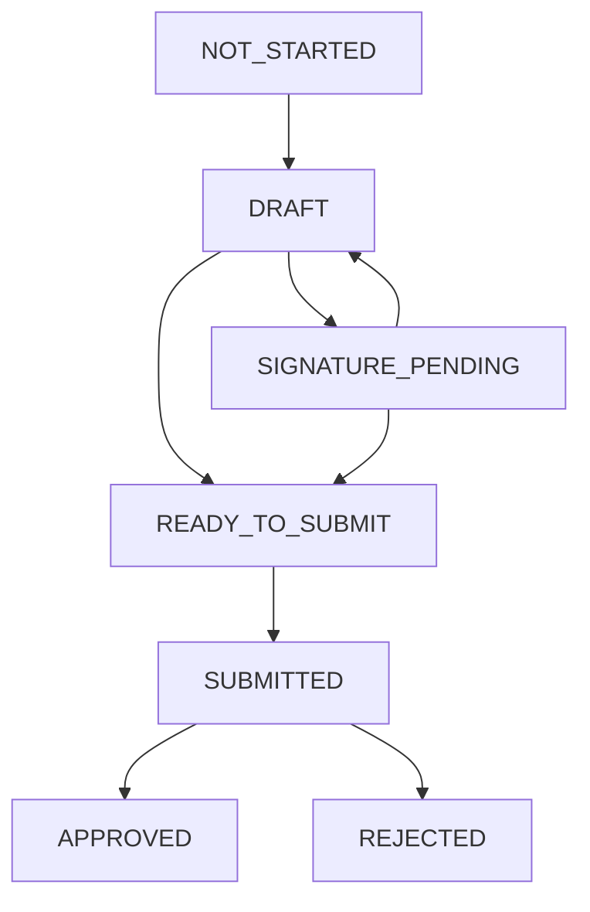

# Assessment Workflow APIs Documentation

## Overview

This document provides comprehensive details about the assessment workflow APIs that handle the final phase of the assessment system. These APIs manage assessment value storage, trainee lock functionality, and assessment submission.

---

## 1. Save Assessment Values API

### 📋 **Purpose**
This API allows authorized users to save assessment values for specific assessment sections, automatically updating section and form statuses based on completion progress.

### 🎯 **Endpoint**
```http
POST /assessments/sections/save-values
```

### 🔐 **Authentication**
- Requires valid JWT token
- Role-based authorization required

### 📝 **Request Schema**
```typescript
{
  assessmentSectionId: string (UUID)  // Required: Target assessment section
  values: Array<{
    assessmentValueId: string (UUID)  // Required: Specific assessment value ID
    answerValue: string | null        // Optional: Answer content (max 2000 chars)
  }>                                  // Required: At least 1 value
}
```

### ✅ **Validations**

#### **Pre-Operation Validations:**
1. **Section Existence:** Assessment section must exist in database
2. **Permission Check:** User must have permission to edit the section based on:
   - Section `editBy` field (TRAINER/TRAINEE)
   - Section `roleInSubject` requirements (EXAMINER/ASSESSMENT_REVIEWER)
   - User's role in the subject/course
3. **Value ID Validation:** All provided `assessmentValueId`s must belong to the specified section
4. **Access Control:** User must have access to the parent assessment form

#### **Business Logic Validations:**
1. **Answer Length:** Answer values cannot exceed 2000 characters
2. **Section Status:** Section can be updated (not locked by system rules)

### 🔄 **Process Flow**
1. Validate user permissions for section editing
2. Verify all assessment value IDs belong to the section
3. Update assessment values in database transaction
4. Set section status to `DRAFT`
5. Set section `assessedById` to current user
5. Update assessment form status logic:
   - `NOT_STARTED` → `DRAFT` (if first section completed)
   - `DRAFT` → `READY_TO_SUBMIT` (if all sections are DRAFT)
   - `SIGNATURE_PENDING` → `READY_TO_SUBMIT` (if all sections are DRAFT)

### 📤 **Response Schema**
```typescript
{
  success: boolean                    // Operation success indicator
  message: string                     // Human-readable message
  assessmentSectionId: string (UUID)  // Processed section ID
  updatedValues: number               // Count of updated values
  sectionStatus: AssessmentSectionStatus // New section status
  assessmentFormStatus: AssessmentStatus  // New form status
}
```

### 🚫 **Error Cases**
| Status | Error | Description |
|--------|--------|-------------|
| 400 | Invalid assessment value IDs | Provided IDs don't belong to section |
| 403 | Permission denied | User lacks permission to edit section |
| 404 | Assessment section not found | Section doesn't exist |

---

## 2. Toggle Trainee Lock API

### 📋 **Purpose**
Controls trainee access to assessment sections by toggling the lock status. Default state is locked (true). When unlocked, allows trainee input and puts assessment in signature pending state.

### 🎯 **Endpoint**
```http
PUT /assessments/{assessmentId}/trainee-lock
```

### 🔐 **Authentication**
- Requires valid JWT token
- Must have access to the assessment form

### 📝 **Request Schema**
```typescript
{
  isTraineeLocked: boolean  // Required: Lock state (true = locked, false = unlocked for trainee input)
}
```

### ✅ **Validations**

#### **Pre-Operation Validations:**
1. **Assessment Existence:** Assessment form must exist
2. **Access Control:** User must have access to the assessment
3. **Date Validation:** Current date must match assessment occurrence date
4. **Trainee Sections:** Assessment must have at least one section with `editBy: "TRAINEE"`

#### **Business Logic Validations:**
1. **Lock State Change:** New lock state must differ from current state
2. **Status Transition:** Valid status transitions based on ALL section completion
3. **Comprehensive Section Check:** When locking, validates both TRAINER and TRAINEE sections

### 🔄 **Process Flow**
1. Validate assessment exists and user has access
2. Check if today matches occurrence date
3. Verify assessment has trainee-editable sections
4. Update lock status and determine new assessment status:
   - **Switch to Unlocked (`false`):** Status → `SIGNATURE_PENDING` (allows trainee input)
   - **Switch to Locked (`true`):** Check ALL section completion:
     - If ALL sections (TRAINER + TRAINEE) are `DRAFT` → Status → `READY_TO_SUBMIT`
     - If ANY section is still `REQUIRED_ASSESSMENT` → Status → `DRAFT`

### 📤 **Response Schema**
```typescript
{
  success: boolean                    // Operation success indicator
  message: string                     // Human-readable message
  assessmentFormId: string (UUID)     // Target assessment ID
  isTraineeLocked: boolean            // New lock state
  status: AssessmentStatus            // New assessment status
}
```

### 🚫 **Error Cases**
| Status | Error | Description |
|--------|--------|-------------|
| 400 | Can only toggle on occurrence date | Current date != assessment date |
| 400 | No trainee sections | Assessment lacks TRAINEE sections |
| 403 | Permission denied | User lacks assessment access |
| 404 | Assessment not found | Assessment doesn't exist |

### 📊 **Lock Status Scenarios**

#### **Scenario 1: Unlock for Trainee Input**
```
Request: isTraineeLocked = false
Result: Status → SIGNATURE_PENDING
Purpose: Allow trainee to access and fill their sections
```

#### **Scenario 2: Lock - All Sections Complete**
```
Condition: ALL sections (TRAINER + TRAINEE) are DRAFT
Request: isTraineeLocked = true  
Result: Status → READY_TO_SUBMIT
Purpose: Assessment ready for final submission
```

#### **Scenario 3: Lock - Trainee Complete, TRAINER Incomplete**
```
Condition: TRAINEE sections = DRAFT, Some TRAINER sections = REQUIRED_ASSESSMENT
Request: isTraineeLocked = true
Result: Status → DRAFT
Purpose: Still waiting for TRAINER sections to be completed
```

#### **Scenario 4: Lock - Trainee Incomplete**
```
Condition: TRAINEE sections = REQUIRED_ASSESSMENT
Request: isTraineeLocked = true
Result: Status → DRAFT  
Purpose: Trainee didn't provide required input
```

---

## 3. Submit Assessment API

### 📋 **Purpose**
Finalizes an assessment by submitting it for review/approval. Validates that all requirements are met before allowing submission.

### 🎯 **Endpoint**
```http
POST /assessments/{assessmentId}/submit
```

### 🔐 **Authentication**
- Requires valid JWT token
- Must have access to the assessment form

### 📝 **Request Schema**
```typescript
// No request body required - all validation is server-side
```

### ✅ **Validations**

#### **Pre-Operation Validations:**
1. **Assessment Existence:** Assessment form must exist
2. **Access Control:** User must have access to the assessment
3. **Status Requirement:** Assessment status must be `READY_TO_SUBMIT`
4. **Section Completion:** All assessment sections must have status `DRAFT`

#### **Submitter Validation:**
1. **Submittable Section Check:** User must have completed (assessedById) at least one section where the template section has `isSubmittable: true`

### 🔄 **Process Flow**
1. Validate assessment exists and user has access
2. Check assessment status is `READY_TO_SUBMIT`
3. Verify all sections are completed (`DRAFT`)
4. Confirm user filled at least one submittable section
5. Update assessment:
   - Status → `SUBMITTED`
   - Set `submittedAt` timestamp
   - Record submission in audit trail

### 📤 **Response Schema**
```typescript
{
  success: boolean                    // Operation success indicator
  message: string                     // Human-readable message
  assessmentFormId: string (UUID)     // Submitted assessment ID
  submittedAt: Date                   // Submission timestamp
  submittedBy: string (UUID)          // Submitter user ID
  status: AssessmentStatus            // New status (SUBMITTED)
}
```

### 🚫 **Error Cases**
| Status | Error | Description |
|--------|--------|-------------|
| 400 | Assessment not ready to submit | Status != READY_TO_SUBMIT |
| 400 | All sections must be completed | Some sections not DRAFT |
| 400 | Must complete submittable section | User didn't fill required sections |
| 403 | Permission denied | User lacks assessment access |
| 404 | Assessment not found | Assessment doesn't exist |

---

## 4. Get Assessment Section Fields API (Enhanced)

### 📋 **Purpose**
Retrieves all fields for an assessment section with template information and current values. Enhanced to support the save values workflow.

### 🎯 **Endpoint**
```http
GET /assessments/sections/{assessmentSectionId}/fields
```

### 🔐 **Authentication**
- Requires valid JWT token
- Role-based authorization required

### ✅ **Validations**

#### **Pre-Operation Validations:**
1. **Section Existence:** Assessment section must exist
2. **Permission Check:** User must have permission to view the section
3. **Access Control:** User must have access to parent assessment

### 📤 **Response Schema**
```typescript
{
  success: boolean
  message: string
  assessmentSectionInfo: {
    id: string (UUID)                 // Assessment section ID (for save API)
    assessmentFormId: string (UUID)
    templateSectionId: string (UUID)
    status: AssessmentSectionStatus
    templateSection: {
      id: string (UUID)
      label: string
      displayOrder: number
      editBy: string                  // TRAINER/TRAINEE
      roleInSubject: string | null    // Required role
      isSubmittable: boolean
      isToggleDependent: boolean
    }
  }
  fields: Array<{
    templateField: {
      id: string (UUID)
      label: string
      fieldName: string
      fieldType: string
      roleRequired: string | null
      options: any | null
      displayOrder: number
      parentId: string | null         // For hierarchical fields
    }
    assessmentValue: {
      id: string (UUID)               // For save values API
      answerValue: string | null      // Current answer
    }
  }>
  totalFields: number
}
```

---

## 5. Update Assessment Values API

### 📋 **Purpose**
Allows users to modify assessment values for sections they have previously assessed. This provides edit capability while maintaining strict ownership controls.

### 🎯 **Endpoint**
```http
PUT /assessments/sections/update-values
```

### 🔐 **Authentication**
- Requires valid JWT token
- Must be the original assessor of the section

### 📝 **Request Schema**
```typescript
{
  assessmentSectionId: string (UUID)  // Required: Target assessment section
  values: Array<{
    assessmentValueId: string (UUID)  // Required: Specific assessment value ID
    answerValue: string | null        // Optional: Updated answer content (max 2000 chars)
  }>                                  // Required: At least 1 value
}
```

### ✅ **Validations**

#### **Pre-Operation Validations:**
1. **Section Existence:** Assessment section must exist in database
2. **Original Assessor Check:** User must be the one who originally assessed the section (`assessedById`)
3. **Section Status:** Section must be in `DRAFT` status (not submitted/locked)
4. **Value ID Validation:** All provided `assessmentValueId`s must belong to the specified section

#### **Business Logic Validations:**
1. **Answer Length:** Answer values cannot exceed 2000 characters
2. **Ownership Validation:** Only the user who filled the section can update it
3. **Status Check:** Can only update sections in DRAFT status

### 🔄 **Process Flow**
1. Validate assessment section exists
2. Check if current user is the original assessor (`assessedById`)
3. Verify section status is DRAFT
4. Validate all assessment value IDs belong to the section
5. Update assessment values in database transaction
6. Return updated count and status

### 📤 **Response Schema**
```typescript
{
  success: boolean                    // Operation success indicator
  message: string                     // Human-readable message
  assessmentSectionId: string (UUID)  // Updated section ID
  updatedValues: number               // Count of updated values
  sectionStatus: AssessmentSectionStatus // Current section status (DRAFT)
}
```

### 🚫 **Error Cases**
| Status | Error | Description |
|--------|--------|-------------|
| 400 | Invalid assessment value IDs | Provided IDs don't belong to section |
| 403 | Only original assessor can update | User didn't originally assess section |
| 403 | Can only update DRAFT sections | Section not in DRAFT status |
| 404 | Assessment section not found | Section doesn't exist |

### 💡 **Key Differences from Save API**
| Aspect | Save API | Update API |
|--------|----------|------------|
| **Permission** | Role-based (TRAINER/TRAINEE) | Original assessor only |
| **Status Change** | Updates to DRAFT | Maintains DRAFT |
| **Form Status** | May update form status | No form status change |
| **Use Case** | Initial assessment | Edit existing assessment |

---

## 🔄 Assessment Status Flow

### Status Transitions


### Status Definitions
| Status | Description | Trigger |
|--------|-------------|---------|
| `NOT_STARTED` | Initial state, no sections completed | Assessment creation |
| `DRAFT` | Work in progress, some sections completed | First section saved |
| `READY_TO_SUBMIT` | All sections complete, ready for submission | All sections DRAFT |
| `SIGNATURE_PENDING` | Waiting for trainee signature/input | Trainee lock disabled (unlocked) |
| `SUBMITTED` | Submitted for review | Submit API called |
| `APPROVED` | Assessment approved | Manual approval |
| `REJECTED` | Assessment rejected | Manual rejection |

---

## 🛡️ Security Considerations

### Role-Based Access Control
1. **TRAINER Role:** Can assess sections with `editBy: "TRAINER"`
2. **TRAINEE Role:** Can assess sections with `editBy: "TRAINEE"` (only their own)
3. **Subject Role Requirements:** Must match `roleInSubject` (EXAMINER/ASSESSMENT_REVIEWER)

### Data Validation
1. **Input Sanitization:** All text inputs sanitized
2. **Length Limits:** Answer values capped at 2000 characters
3. **UUID Validation:** All IDs validated as proper UUIDs

### Audit Trail
1. **User Actions:** All modifications track `assessedById`
2. **Timestamps:** Creation and modification times recorded
3. **Status Changes:** Assessment status transitions logged

---

## 📊 Usage Examples

### Complete Assessment Workflow
```typescript
// 1. Get section fields
GET /assessments/sections/{sectionId}/fields

// 2. Save assessment values (initial)
POST /assessments/sections/save-values
{
  "assessmentSectionId": "uuid",
  "values": [
    {
      "assessmentValueId": "uuid",
      "answerValue": "Excellent performance"
    }
  ]
}

// 2b. Update assessment values (edit existing)
PUT /assessments/sections/update-values
{
  "assessmentSectionId": "uuid",
  "values": [
    {
      "assessmentValueId": "uuid",
      "answerValue": "Outstanding performance - updated assessment"
    }
  ]
}

// 3. Toggle trainee lock (if needed)
PUT /assessments/{assessmentId}/trainee-lock
{
  "isTraineeLocked": true
}

// 4. Submit assessment
POST /assessments/{assessmentId}/submit
```

### Error Handling Pattern
```typescript
try {
  const response = await fetch('/assessments/sections/save-values', {
    method: 'POST',
    headers: {
      'Content-Type': 'application/json',
      'Authorization': 'Bearer ' + token
    },
    body: JSON.stringify(payload)
  });
  
  if (!response.ok) {
    const error = await response.json();
    // Handle specific error cases
    switch (response.status) {
      case 400: // Validation error
      case 403: // Permission denied
      case 404: // Not found
        // Show user-friendly message
        break;
    }
  }
  
  const result = await response.json();
  // Handle success
} catch (error) {
  // Handle network errors
}
```

---

## � Enhanced Status Flow Scenarios

### **Save Assessment Values Status Transitions**

#### **Scenario 1: Normal Assessment Flow**
```
NOT_STARTED → (save first section) → DRAFT → (save all sections) → READY_TO_SUBMIT
```

#### **Scenario 2: Trainee Assessment During Signature Pending**
```
DRAFT → (unlock trainee) → SIGNATURE_PENDING → (trainee completes section) → READY_TO_SUBMIT
```

#### **Scenario 3: Mixed Section Completion**
```
SIGNATURE_PENDING → (any user completes last section) → READY_TO_SUBMIT
DRAFT → (any user completes last section) → READY_TO_SUBMIT
```

### **Key Status Transition Rules**
1. **NOT_STARTED** always transitions to **DRAFT** on first section save
2. **DRAFT** transitions to **READY_TO_SUBMIT** when all sections are DRAFT
3. **SIGNATURE_PENDING** transitions to **READY_TO_SUBMIT** when all sections are DRAFT
4. Any other status maintains current state until all sections complete

### **Trainee Lock Integration**
- When trainee lock is **disabled** (`false`): Form goes to **SIGNATURE_PENDING**
- If trainee completes their section while in **SIGNATURE_PENDING**: Can transition directly to **READY_TO_SUBMIT**
- This allows seamless flow without requiring lock/unlock cycles

---

## �🔧 Technical Implementation Notes

### Database Transactions
- All multi-step operations use database transactions
- Ensures data consistency during status updates
- Rollback capability on failures

### Performance Considerations
- Efficient queries with proper joins
- Minimal database round trips
- Optimized for concurrent access

### Monitoring & Logging
- Comprehensive error logging
- Performance metrics tracking
- User action audit trails

---

This documentation provides complete details for implementing and using the assessment workflow APIs effectively and securely.